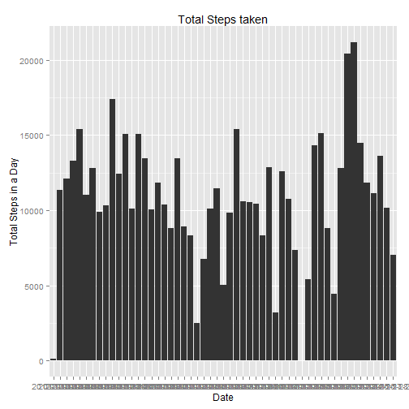
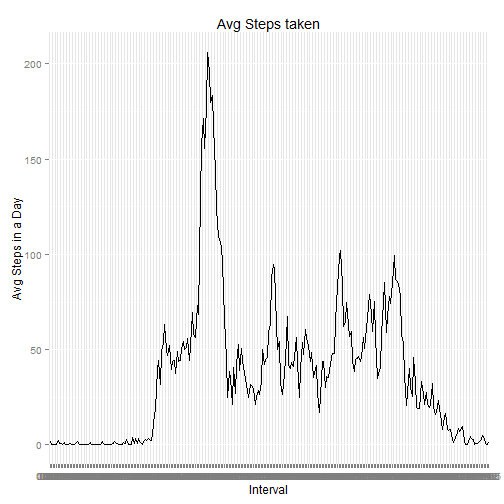
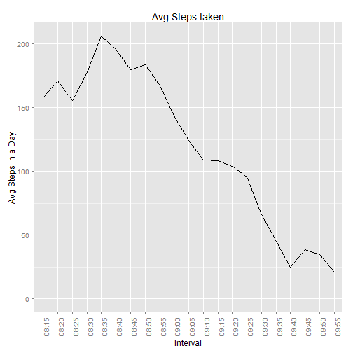
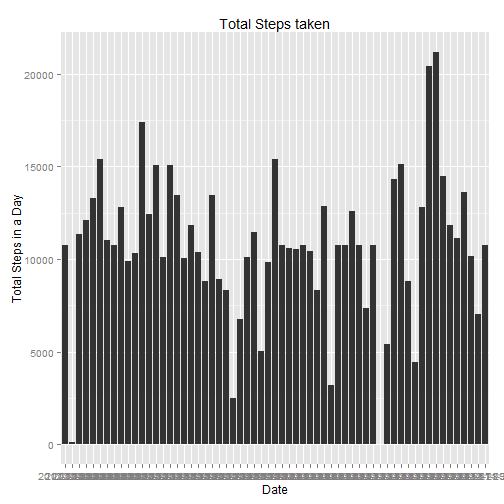
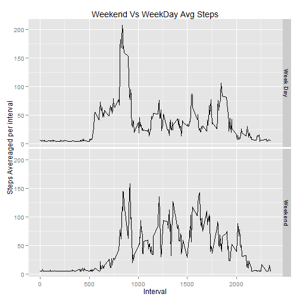

# Reproducible Research: Peer Assessment 1


```r
library(ggplot2)
library(data.table)
```

## Loading and preprocessing the data


```r
activity = read.csv("activity.csv")
```

## What is mean total number of steps taken per day?

Converting the data frame into a data table


```r
activity_without_na = na.omit(activity)

Data = data.table(activity_without_na) 
steps_per_day = Data[, sum(steps), by="date"]
ggplot(steps_per_day,aes(x=steps_per_day$date,y=steps_per_day$V1)) + geom_bar(stat = "identity") + labs(title="Total Steps taken", x="Date",y="Total Steps in a Day")
```

 


```r
mean(steps_per_day$V1)
```

```
## [1] 10766
```

```r
median(steps_per_day$V1)
```

```
## [1] 10765
```

## What is the average daily activity pattern?


```r
steps_per_interval = Data[, mean(steps), by="interval"]
time = Sys.time();
time = as.POSIXlt(time)
time$hour = 0
time$min = 0
time$sec =0
newCol=""
for (i in 1:288){newCol[i] = (format(time, "%H:%M"));time$min = time$min + 5}
steps_per_interval$timeInterval = newCol
ggplot(steps_per_interval,aes(x=steps_per_interval$timeInterval,y=steps_per_interval$V1,group=1)) + geom_line(stat = "identity") +  labs(title="Avg Steps taken", x="Interval",y="Avg Steps in a Day")
```

 
## Which 5-minute interval, on average across all the days in the dataset, contains the maximum number of steps?

Highlight only the area around the peak range in the above graph


```r
ggplot(steps_per_interval,aes(x=steps_per_interval$timeInterval,y=steps_per_interval$V1,group=1)) + geom_line(stat = "identity") +  theme(axis.text.x=element_text(angle=90)) +  xlim(steps_per_interval$timeInterval[100:120]) +  labs(title="Avg Steps taken", x="Interval",y="Avg Steps in a Day")
```

```
## Warning: Removed 267 rows containing missing values (geom_path).
```

 

Its clear from the above graph, the interval at 8:35 has the max number of steps
## Imputing missing values

- Calculate and report the total number of missing values in the dataset (i.e. the total number of rows with NAs)


```r
activity_na = activity[is.na(activity),]
length(activity_na[,1])
```

```
## [1] 2304
```
- Devise a strategy for filling in all of the missing values in the dataset. The strategy does not need to be sophisticated. For example, you could use the mean/median for that day, or the mean for that 5-minute interval, etc.

Fill the NA with the mean value


```r
for (i in which(sapply(activity, is.numeric))) {
    activity[is.na(activity[, i]), i] <- mean(activity[, i],  na.rm = TRUE)
}
```
- Make a histogram of the total number of steps taken each day and Calculate and report the mean and median total number of steps taken per day. Do these values differ from the estimates from the first part of the assignment? What is the impact of imputing missing data on the estimates of the total daily number of steps?


```r
Data = data.table(activity) 
steps_per_day = Data[, sum(steps), by="date"]
ggplot(steps_per_day,aes(x=steps_per_day$date,y=steps_per_day$V1)) + geom_bar(stat = "identity") + labs(title="Total Steps taken", x="Date",y="Total Steps in a Day")
```

 


```r
mean(steps_per_day$V1)
```

```
## [1] 10766
```

```r
median(steps_per_day$V1)
```

```
## [1] 10766
```

We can infer there is no difference in the mean and median, as the missing values were replaced only with the mean value. Hence there was no impact on the final mean


## Are there differences in activity patterns between weekdays and weekends?


```r
Data = data.table(activity) 
Data$DAY = weekdays(as.Date(Data$date),)
Data$wk = Data$DAY %in% c("Saturday","Sunday")
Data = Data[, mean(steps), by=c("wk","interval")]
Data$wk[Data$wk] = "Weekend"
Data$wk[Data$wk == FALSE] = "Week Day"
ggplot(Data,aes(x=Data$interval,y=(Data$V1))) + geom_line() +  facet_grid(wk ~.) + labs(title="Weekend Vs WeekDay Avg Steps", x="Interval",y="Steps Avereaged per interval")
```

 
